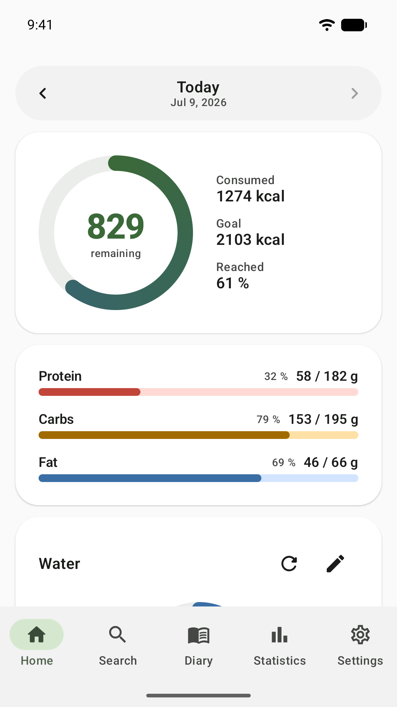
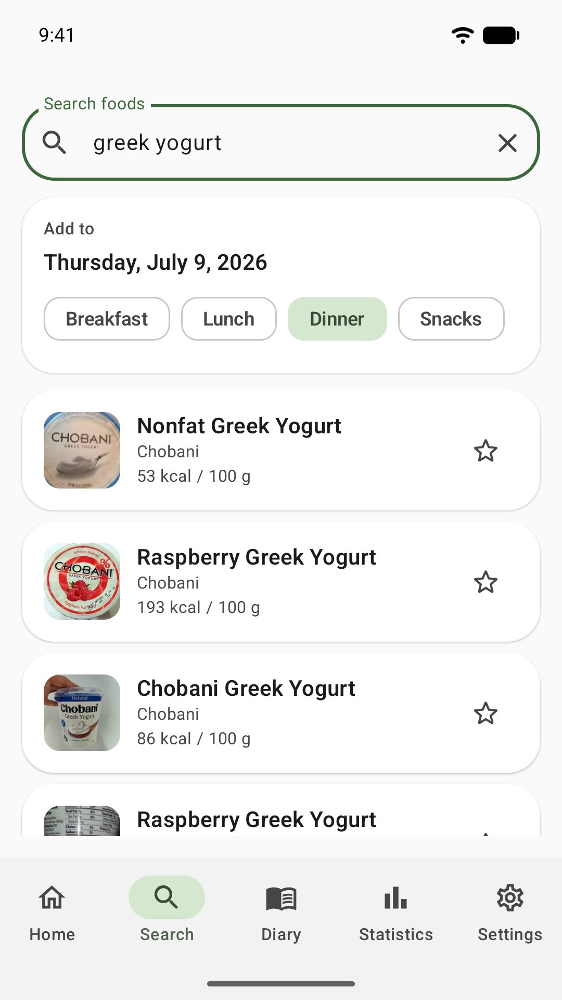
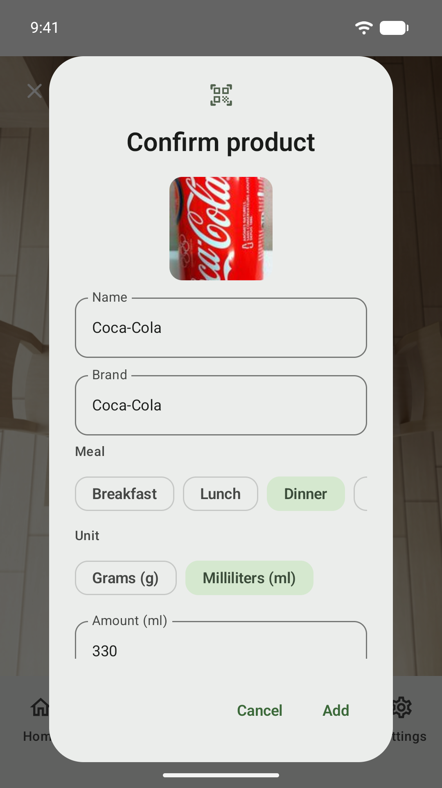
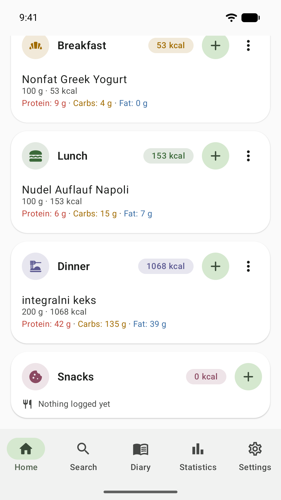
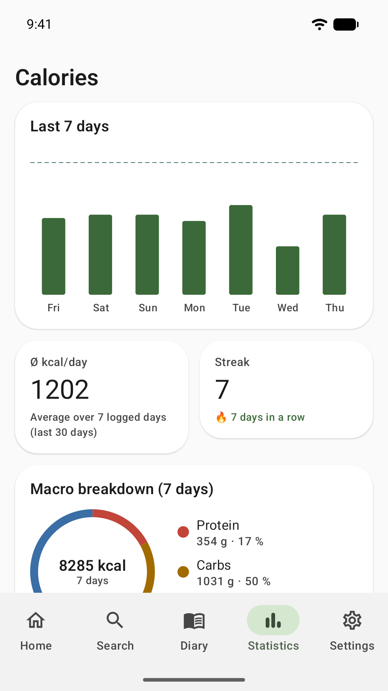

# FairTrack

[](https://github.com/daonware-it/FairTrack/actions/workflows/ci.yml)
[](https://github.com/daonware-it/FairTrack/actions/workflows/codeql.yml)
[](https://github.com/daonware-it/FairTrack/releases/latest)

An offline-first calorie and nutrition tracker for Android, built with Kotlin and Jetpack Compose.

**All data stays on the device. No account, no cloud, no tracking, no ads.**

Most calorie trackers want an email address before they will let you weigh a banana, then sync your
eating habits to a server you cannot see. FairTrack does neither. It opens straight into today's
diary, stores everything in a local database, and the only thing it ever sends over the network is a
barcode you chose to scan. There is no analytics SDK in the dependency list — you can check.

Log meals by barcode, by searching an open food database, or from recipes you build yourself. Set
calorie and macro goals derived from your body metrics, then watch weight, body measurements, water
intake and fasting windows move over time.

> **Status:** version 1.0.1, the first public release.
> Grab the APK from [Releases](https://github.com/daonware-it/FairTrack/releases/latest), or read the
> [changelog](CHANGELOG.md) to see what changed.

## Screenshots

| Home | Search | Barcode scanner |
| :---: | :---: | :---: |
|  |  |  |

| Diary | Statistics |
| :---: | :---: |
|  |  |

## Features

**Food logging**
- Barcode scanning via CameraX + ML Kit, resolved against the [Open Food Facts](https://openfoodfacts.org) API
- Full-text product search
- A curated offline catalogue of 116 fruits and vegetables — no network required
- Custom foods with named portions, and multi-ingredient dishes with per-serving nutrition
- Favourites, meal templates and a "recently eaten" list
- Beverages logged in millilitres, solids in grams

**Goals & body**
- Calorie and macro targets from Mifflin–St Jeor BMR × activity factor, with manual overrides
- Protein and fat scale with your goal and activity level; carbohydrates take the remainder
- BMI feedback with an age-dependent healthy range, and a guard against underweight targets
- Weight history plus body measurements (waist, body fat %, chest, arm) with trend charts

**Daily habits**
- Water tracker with a daily goal and optional interval reminders
- Intermittent fasting timer with presets (14:10, 16:8, 18:6, 20:4, OMAD, and day-based 5:2),
  a live countdown, and an ongoing notification that keeps ticking while the app is closed

**Your data**
- Export the whole diary to a JSON file and restore it on another device
- Android's automatic cloud backup is switched **off** on purpose: it would place your diary,
  weight and body measurements in Google Drive, which is exactly what this app promises not to do

**Insight & polish**
- Statistics: weekly calorie bars, a macro donut, logging streaks, micronutrient coverage
- Micronutrient tracking (14 vitamins and minerals) against EU nutrient reference values,
  with a curated offline dataset for basic foods
- Home-screen widgets (calories, compact calories, water) built with Jetpack Glance
- Light/dark themes, optional Material You, metric and imperial units
- Fully localised in German, English and Spanish

All charts are drawn directly on a Compose `Canvas` — the app pulls in no charting library.

## Installing

Download the APK from the [latest release](https://github.com/daonware-it/FairTrack/releases/latest)
and open it on your phone. Android 7.0 or newer.

Releases here are signed with a testing key, while a Play Store install is signed by Google. Android
refuses to replace an app with a build that carries a different signature, so **a sideloaded APK and
a Play install cannot update one another** — pick one source and stay with it. If you switch, export
your data first (Settings → Backup), uninstall, then install the other build and restore.

## Tech stack

| Concern | Choice |
| --- | --- |
| Language | Kotlin 2.3.20 |
| UI | Jetpack Compose (Material 3), Glance for widgets |
| Architecture | MVVM, unidirectional state via `StateFlow` |
| Dependency injection | Hilt |
| Persistence | Room (with real, versioned migrations), DataStore for preferences |
| Networking | Retrofit, OkHttp, kotlinx.serialization |
| Background work | WorkManager |
| Images | Coil |

Targets `compileSdk`/`targetSdk` 36 and `minSdk` 24 (Android 7.0), using core library desugaring so
`java.time` is available on older devices.

## Building

Requires **JDK 17** and the Android SDK.

```bash
git clone https://github.com/daonware-it/FairTrack.git
cd FairTrack
./gradlew :app:assembleDebug        # macOS / Linux
.\gradlew.bat :app:assembleDebug    # Windows
```

`local.properties` is not checked in; Android Studio will create it and point `sdk.dir` at your SDK.

Open the project in Android Studio and let it use the **Gradle wrapper** (Gradle 9.6.1) rather than a
globally installed Gradle — the Android Gradle Plugin version in use requires it.

To compile without packaging:

```bash
./gradlew :app:compileDebugKotlin
```

### Performance benchmarks

Cold and warm startup are measured with Macrobenchmark against a release-like build. Needs a
connected device or a running emulator:

```bash
./gradlew :benchmark:connectedBenchmarkAndroidTest
```

Results land in `benchmark/build/outputs/connected_android_test_additional_output/`. CI runs the same
benchmark weekly on an emulator; treat the trend as the signal, not the absolute numbers.

## Continuous integration

| Workflow | Runs on | Does |
| --- | --- | --- |
| `ci.yml` | every push and PR | compiles the debug variant |
| `codeql.yml` | PRs, weekly | CodeQL static analysis of the Kotlin sources |
| `benchmark.yml` | weekly, on demand | startup timings on an emulator |
| `release.yml` | tag `v*`, on demand | builds the signed APK and publishes a GitHub release |

Third-party actions are pinned to commit SHAs rather than movable tags, every workflow starts from
`permissions: {}`, and Dependabot keeps both the pins and the Gradle dependencies current.

The signed Play Store bundle is built by a separate Azure DevOps pipeline (`azure-pipelines.yml`), so
the Play upload key never touches this repository's secrets.

## Project structure

```
app/src/main/java/com/fairtrack/app/
├── data/          entities, DAOs, repositories, migrations, nutrition maths
│   ├── network/   Open Food Facts API and DTOs
│   ├── produce/   offline fruit & vegetable catalogue
│   └── bls/       offline micronutrient data for basic foods
├── di/            Hilt modules
├── ui/            one package per screen (home, search, scanner, statistics, …)
│   ├── theme/     design tokens: colours, spacing, shapes
│   └── widget/    Glance app widgets
└── work/          WorkManager workers, schedulers, notification receivers
```

### Database migrations

The Room schema is exported to `app/schemas/`, and every schema change ships an explicit `Migration`
in `data/Migrations.kt`. Destructive fallback is enabled for downgrades only, so a missing migration
fails loudly instead of silently wiping user data.

## Data sources

Nutritional data comes from [Open Food Facts](https://openfoodfacts.org), available under the
[Open Database License](https://opendatacommons.org/licenses/odbl/1-0/). Micronutrient values for
basic foods are derived from the German *Bundeslebensmittelschlüssel* (BLS 4.0), published by the
Max Rubner-Institut under CC BY 4.0.

Nutrient reference values follow the EU Food Information to Consumers Regulation (1169/2011).

## License

Source-available, **not** open source in the OSI sense. You may read, build, modify and run FairTrack
for private, non-commercial use, and contribute back. Redistribution — including publishing it to an
app store — requires visible attribution to this project, both in the listing and inside the app.
Commercial use needs written permission.

The full terms are in [LICENSE](LICENSE) (German). Where this summary and the licence disagree, the
licence wins.

## Disclaimer

FairTrack is a personal tracking tool, not a medical device. Nothing it displays is medical advice.
Nutritional values are only as accurate as their crowd-sourced and reference sources, and product
coverage — micronutrients in particular — is uneven. Consult a qualified professional before making
decisions about your diet or health.
